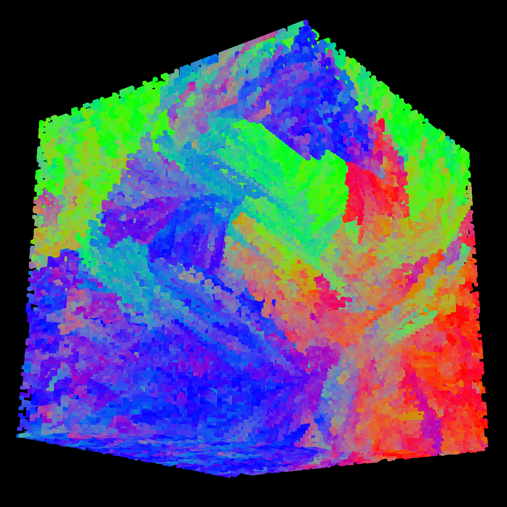
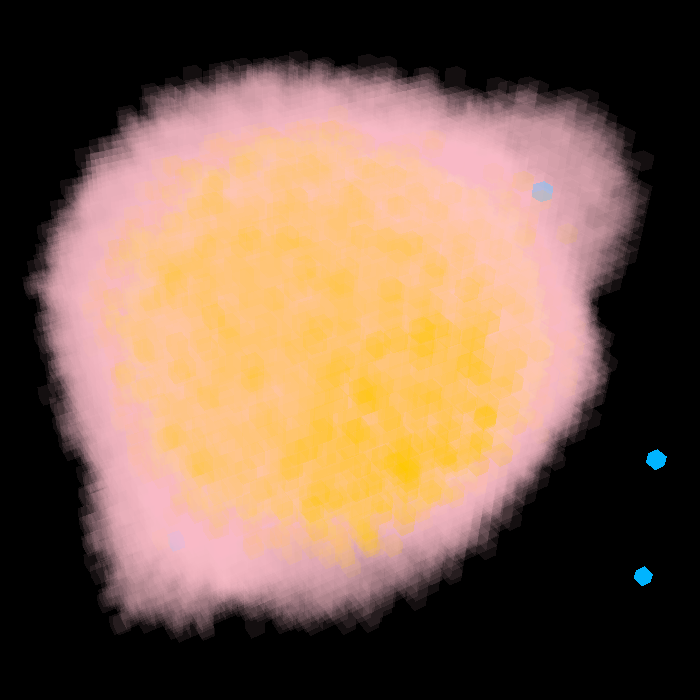
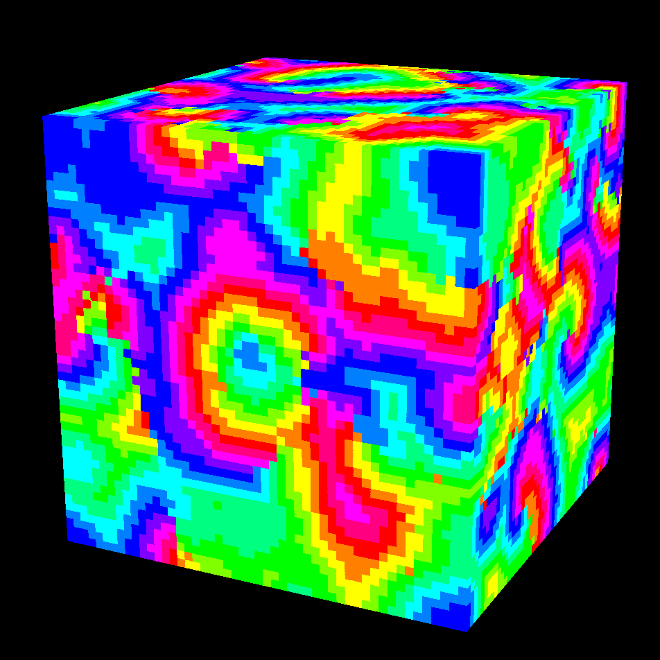
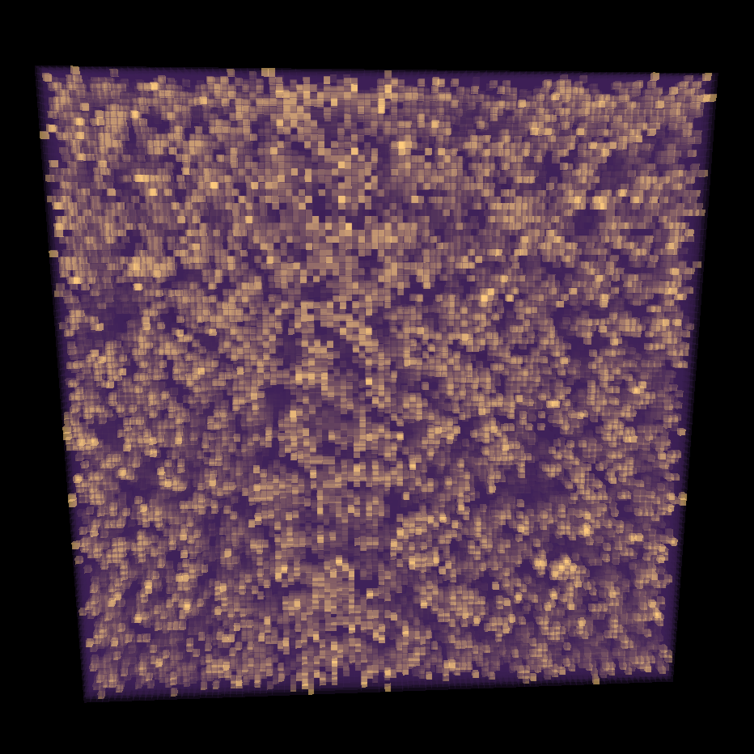

# 3D cellular automata simulation engine
By Mark (@Marcus228), Moses (@Moses-Bejon), Sze Yoong (@szeyoong-low), and Szymon (@Szymonbilk), June 2026

We are Computing undergraduates at [Imperial College London](https://www.imperial.ac.uk/computing/).
This is the extension of our first year group project. We were required to use C as our main programming language, but what we built was entire up to us.

## Idea
A cellular automaton is a simulation that "evolves through a number of discrete time steps according to a set of rules based on the states of neighbouring cells" (source: [Wolfram MathWorld](https://mathworld.wolfram.com/CellularAutomaton.html)). Inspired by [Conway's *Game of Life*](https://playgameoflife.com/), we wondered if we could extend it from two dimensions to three. Soon after we started building it, we realised that our simulator has the potential to model a multitude of complex real-life systems like cancer cell metastasis and [particle physics](https://sandbox-science.com/particle-life). Thus, we decided to take on a more ambitious goal to build a 3D cellular automata simulation engine.

Our engine is:
- **Fully customisable**: Users can build simulations simply by defining how cells should be represented, initialised, and updated. Our engine imposes no limitations on users' creativity.

- **Highly performant**: It is run on a multi-threaded CPU program and is rendered with an optimised GPU-native pipeline.

- **Interactive**: Users can zoom and pan the camera around the simulation. If optional visual enhancements are disabled, our simulations are highly responsive even at up to a million cells.

- **Beautiful**: Users can determine the colour and transparency of every cell. They can also enable lighting effects with just one flag.

These are a few systems we have been able to simulate. To see them in action, run `demo.sh` from the project root.

<table>
    <tr>
        <td width="200" align="center"></td>
        <td width="200" align="center"></td>
        <td width="200" align="center"></td>
        <td width="200" align="center"></td>
    </tr>
    <tr>
        <td width="200" align="center" valign="top"><b>Crystal formation</b></td>
        <td width="200" align="center" valign="top"><b>Slime growth</b></td>
        <td width="200" align="center" valign="top"><b>Rainbow rippling tank</b></td>
        <td width="200" align="center" valign="top"><b>The cosmos</b></td>
    </tr>
    <tr>
        <td width="200" align="center" valign="top"></td>
        <td width="200" align="center" valign="top">The slime (yellow) sends out pheromones (pink) to detect food (blue) and grow towards it</td>
        <td width="200" align="center" valign="top"></td>
        <td width="200" align="center" valign="top">We programmed the laws of gravity and let the emergent behaviour create the yellow filaments</td>
    </tr>
</table>

We hope to create more complex, exciting simulations and further optimise the renderer to support them. Check out our issues page to see features and fixes in the pipeline

## Tech stack
- C18
- GNU Make
- OpenGL 4.5
- [GLFW](https://www.glfw.org/) OpenGL context manager
- [OpenGL Mathematics (glm) for C (CGLM)](https://github.com/recp/cglm)
- POSIX `pthreads`
- GNU `argp`
- [GNU `dlfcn`](https://pubs.opengroup.org/onlinepubs/7908799/xsh/dlfcn.h.html)

## User interface
The program is run with a path to a compiled cell configuration file, which is expected to end with `.so`. Any configuration defined in the project will be compiled automatically by our GNU Make toolchain into the `bin/` directory. With command-line flags, parsed by the GNU `argp` library, users can adjust program parameters. This includes the number of CPU threads used to run the simulation, and the simulation's dimensions.

## Simulation engine
The simulation engine uses an internal representation to hold its dimensions, threads, as well as cell initialisation and update protocols. Runtime parameters like these are injected into the simulation in the main program loop by the configuration loader. The dynamic loader returns generic pointers, which are appropriately type-casted. The cells are stored in two different byte-addressable buffers, one of which is read-only (current state) and the other is write-only (next state) at any point in time.

The main logic of the engine is in the `sim_step` function. We leverage multi-threading (via the POSIX `pthread` library) to update the cells. Each thread receives a specific slice of the simulation to process, and is synchronised with others using thread barriers. As a result, all threads are guaranteed to finish processing in sync.

The simulator's architecture imposes few restrictions on the rules users can implement. All users need to do is to implement the `include/configuration.h` interface in a C configuration file in the `custom_cell/` directory. These are then dynamically loaded as libraries using the `cell_loader`, and the required functions fetched as symbols and dynamically dispatched as function pointers when called.

Users are required to define a cell type, which can be just a Boolean value recording whether it is "dead" or "alive", or contain numerous arbitrary fields such as the "age" of a cell. They are also responsible for specifying how the simulator should set up this internal state of each cell (`cell_init`) and update it based on its neighbours' state (`cell_update`). The only part of the simulator exposed to the renderer via `sim_render_info` is the external state of the cell, which is an RGBA value.

## Design of renderer
Our goal to simulate virtually all conceivable cellular automata at arbitrarily large scales while providing a highly responsive moving camera presented immense performance challenges. While the GPU excels at massive parallel workloads, the CPU still needs to orchestrate every job sent to it sequentially. This is especially costly for dense simulations in which most cells are hidden behind others but a draw call is still made.

We managed to drastically cut latency through various [stream reduction optimisations](https://developer.nvidia.com/gpugems/gpugems2/part-iv-general-purpose-computation-gpus-primer/chapter-36-stream-reduction) that remove these cells before they reach the GPU. This was initially accomplished through CPU-side culling, which builds up a buffer of visible cells by checking if each cell in the simulation is too faint to be seen, hidden by its neighbours, or lies outside the camera's view frustum. However, it is suboptimal to tackle a massive number of independent computations sequentially.

As such, we redesigned the entire rendering pipeline to be GPU-native. The culling is now done in parallel by compute shaders and the results are cached in the GPU for the graphics shaders. This has the additional benefit of minimising data transfers over the PCIe bus, which is the biggest bottleneck on GPU acceleration, as most data is transferred only once per simulation update.

To further reduce such pipeline stalls, we thoroughly compressed our data representations. For example, we use index buffers to reference repeatedly used vertex coordinates and pack RGBA colour channels into a single 32-bit integer.

When developing support for translucent cells, we encountered severe [z-fighting](https://www.youtube.com/watch?v=9AcCrF_nX-I&pp=0gcJCT8LAYcqIYzv) manifested as flickering colours of all faces along the boundary between chunks processed by different GPU working groups. This was because the blending technique used by the OpenGL graphics library depends on the order in which the cells were drawn, but the concurrent culling causes cells to be ordered non-deterministically. We addressed this by sorting cells so that those furthest from the camera are drawn first, making the see-through effect consistent. Although the parallel nature of the [bitonic merge sort algorithm](https://developer.nvidia.com/gpugems/gpugems2/part-vi-simulation-and-numerical-algorithms/chapter-46-improved-gpu-sorting) we used fully exploits the GPU hardware it runs on, it still caused noticeable latency on small simulations due to the overhead of concurrency control. As such, we allowed the user to toggle transparency support so that this is only incurred when necessary.

Our renderer allows users to see the simulation up close by scrolling in and dragging the window. Before rendering each frame, we use users' mouse interactions to compute rotation and projection matrices to transform the 3D space to fit their perspective.

## Sources of inspiration
- [Conway's *Game of Life*](https://playgameoflife.com/)
- [Particle life](https://sandbox-science.com/particle-life)
- [Visual PDE](https://visualpde.com/)
- [Emoji simulator](https://ncase.me/sim/?s=conway)
- [3D Cellular Automata - Softology](https://www.youtube.com/watch?v=dQJ5aEsP6Fs)
- [Complex Behaviour from Simple Rules: 3 Simulations - Sebastian Lague](https://www.youtube.com/watch?v=kzwT3wQWAHE)
- [Candidates for the Game of Life in Three Dimensions - Carter Bays](https://content.wolfram.com/sites/13/2018/02/01-3-1.pdf)

## References
- [I Optimised My Game Engine Up To 12000 FPS](https://www.youtube.com/watch?v=40JzyaOYJeY)
- [Learn OpenGL](https://learnopengl.com/)
- [The Definitive Guide to OpenGL VBOs, VAOs, and EBOs - Deyan Sirakov](https://medium.com/@deyan.sirakov2006/the-definitive-guide-to-opengl-vbos-vaos-and-ebos-6193ab13ccc5)
- [Coordinate Spaces in OpenGL: Frames of Reference for Creating 3D Graphics - Francisco Zavala](https://medium.com/imagecraft/coordinate-spaces-in-opengl-frames-of-reference-for-creating-3d-graphics-87a078b286eb)
- [GPU Driven Rendering Overview - Vulkan Guide](https://vkguide.dev/docs/gpudriven/gpu_driven_engines/)
- [Ambient occlusion for Minecraft-like worlds - 0fps](https://0fps.net/2013/07/03/ambient-occlusion-for-minecraft-like-worlds/)
- [Palette Compression - Voxel.wiki](https://voxel.wiki/wiki/palette-compression/)
- [The Book of Shaders - Patricio Gonzalez Vivo, Jen Lowe](https://thebookofshaders.com/)
- [Crafting a Clean, Maintainable, and Understandable Makefile for a C Project - Luca Cavallin](https://www.lucavallin.com/blog/crafting-clean-maintainable-understandable-makefile-for-c-project)
- [How to Structure C Projects: These Best Practices Worked for Me - Luca Cavallin](https://www.lucavallin.com/blog/how-to-structure-c-projects-my-experience-best-practices)
-[What is WebGPU? - Suboptimal engineer](https://www.youtube.com/watch?v=oIur9NATg-I)
- [Intro to Graphics Programming (What it is and where to start) - the lemon](https://www.youtube.com/watch?v=Jw-g_Zrz4Ys)
- [How Does Lighting Work in Games? (a brief history of Phong reflection) - Undeniable Dilemma](https://www.youtube.com/watch?v=oEwhDKB0BnQ)
- [Creating My Own 3D Graphics Engine - Inkbox](https://www.youtube.com/watch?v=OJoZSRnU0is&t=1189s)
- [The PERFECT voxel rendering pipeline (and online demo) [Voxel Devlog #7] - Douglas](https://www.youtube.com/watch?v=IFUj53VwYvU&t=741s)
